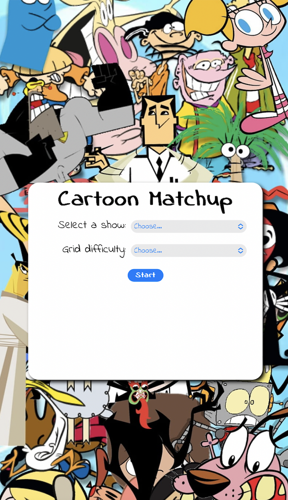
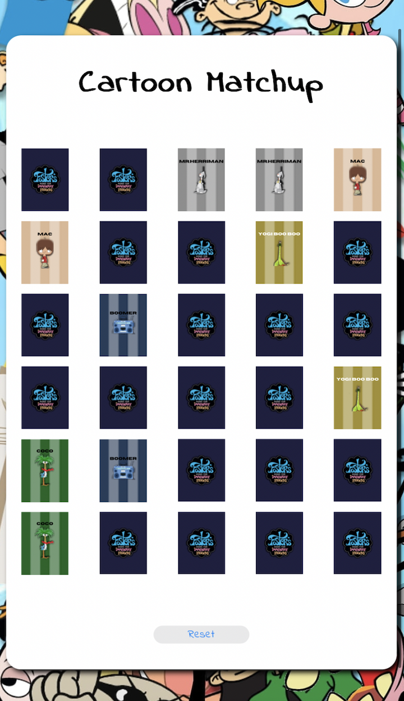

# Cartoon-Matchup

Welcome to the Cartoon Matchup! This fun and engaging project brings the classic card matching game to life with a delightful cartoon theme. Challenge your memory and have a great time pairing up cartoon cards in this entertaining game.

## Table of Contents

- [Introduction](#introduction)
- [Features](#features)
- [Getting Started](#getting-started)
- [How to Play](#how-to-play)

## Introduction

Cartoon Matchup is a web-based application that allows users to play the classic card matching game with a whimsical cartoon twist. It's designed to be enjoyable for players of all ages, providing a delightful gaming experience.

## Features

- **Cartoon Theme:** Immerse yourself in a world of colorful and charming cartoon characters.
- **Memory Challenge:** Test and improve your memory skills by matching pairs of cards.
- **Responsive Design:** Play the game on various devices with a responsive and user-friendly interface.

    
    

## Getting Started

To get started with the Cartoon Card Matching Game, follow these steps:

1. Launch the game by clicking this link --> [Cartoon Matchup Homepage](https://e-albert.github.io/Cartoon-Matchup/)

## How to Play

1. **Start the Game:** Open the game in your web browser.
2. **Match Cards:** Click on two cards to reveal their characters. Try to match pairs of identical cards.
3. **Winning:** Successfully match all the pairs to win the game.